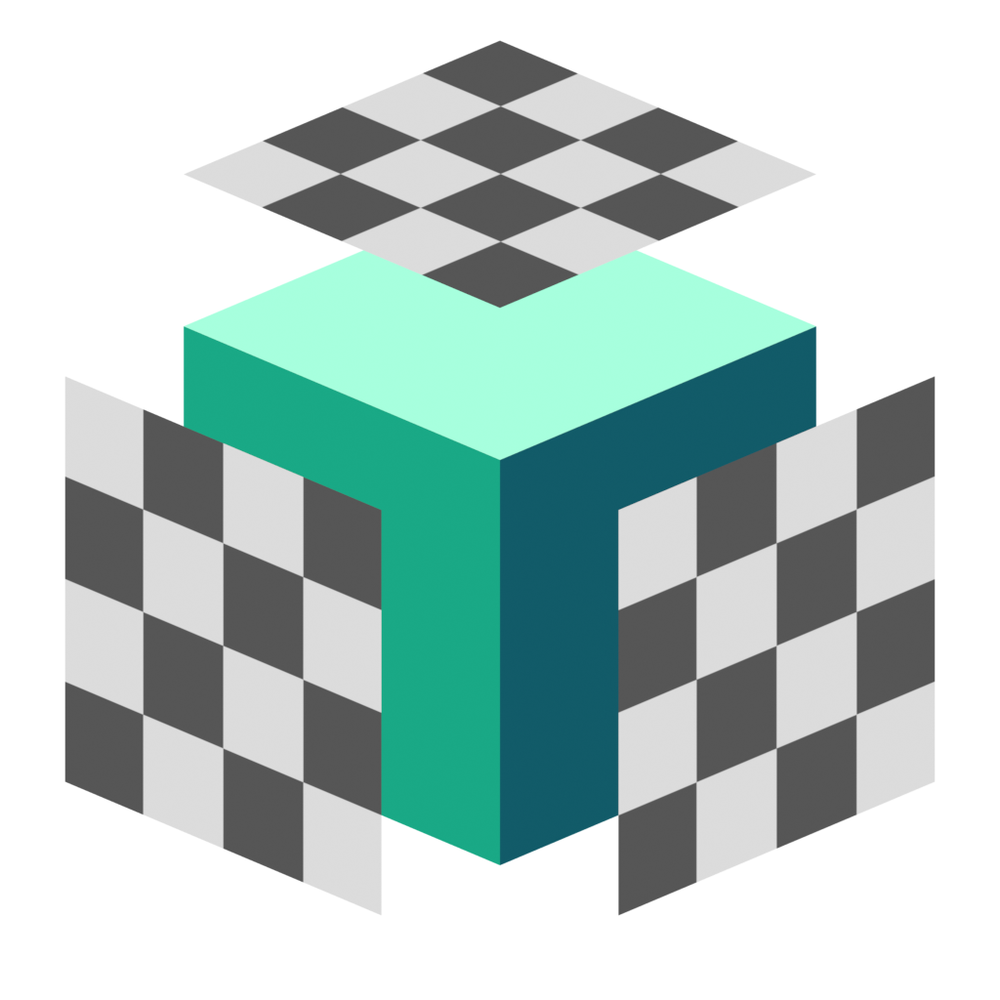

# Create UVs

## UV Generation Methods

There are 3 methods for generating UVs with uvFactory. Each is available as both a modifier and an edit mesh tool:

- [Box Project](#box-project)
- [Island Project](#island-project)
- [Island Unwrap](#island-unwrap)

### Box Project

{ width=80 align=left}
Box Project is the simplest and fastest method. Each face is planar projected from the most appropriate axis. It is a fairly standard way of projecting UVs and is similar to the method in Blender's Texture Shader node.

**Pros:** Fastest method of UV generation, very stable, stretching is limited to 45 degrees

**Cons:** Stretching likely on non-perpendicular surfaces (projection can be rotated to minimize this)

### Island Project

{ width=80 align=left}
Island Project performs a planar UV projection per [island](#defining-uv-islands). UVs are oriented based on the model's Z axis. This works well for models made of flat surfaces but there will be stretching if islands are curved.

**Pros:** Fast, no stretching for flat UV islands, suitable for architectural/faceted meshes.

**Cons:** If UV island surfaces bend too much or go around corners there will be stretching as this method only uses planar projection.

### Island Unwrap

{ width=80 align=left}
Island Unwrap is the most advanced projection method. It unwraps and flattens each [island](#defining-uv-islands) then orients the UVs in the same way as [Island Project](#island-project). It also has logic for handling cylindrical or looped UV islands.

On low to mid poly meshes with sharp edges, this method produces the best fully automatic results.

**Pros:** Can handle curved surfaces, often produces the best UVs out of the 3 methods with the least stretching if seams are properly defined.

**Cons:** This is the slowest generation method, especially when seams are poorly defined. It's also not quite as stable as the other two methods.

## Defining UV Islands

**Island Project** and **Island Unwrap** first define where UV islands are using seam edges. These can be marked up on the mesh and/or generated by edge angle, sharp edges and existing seams in the UV Map. These options are found in the generator's [Seams](#seams) section.

----

## Method Comparison

Here we can see the three methods together. Notice how they each handle different surfaces

----

## Settings

Most of the settings for UV generators are identical across generation methods. Specific settings are identified in the relevant sections.

- **Tile Size.** Scales the UVs. For tiling textures this should match the expected size of the texture.
- **UV Map.** Which UV map to write to. This is a string parameter currently, be sure the name matches the map you wish to write to.

### Seams

!!! info "Island Project & Island Unwrap only"
Control where seam edges are to define UV islands. From Blender 4.4 this picks up edges marked as ***seam*** by default.

- **Edge Angle.** Edges that have a greater angle than that specified will be used as seams. Setting this to 360 or above will effectively disable seams by edge angle.
- **Sharp Edges.** Edges marked as sharp will be used as UV seams.
- **Detect Existing.** Use existing seams in the specified UV map. This will only detect seams if there is a gap in UV space, it cannot detect unwelded UVs or the seam attribute.
- **Attribute.** Specify an edge attribute to use as seams. As of Blender 4.4 this will detect manually marked seams when set to the "uv_seam" attribute.

### Selection

Controls which faces the UV modifier applies to.

- **Selection.** Defaults to generating UVs for every face. You can limit to vertex groups by specifying as an attribute.
- **Material.** Limit the UV generation to a specific material.
- **Invert Selection.** Inverts the selection to generate UVs on every face that isn't selected using the above options.

### UV Transform

Transform the UVs in UV space after they have been generated.

- **Offset U.** Offsets generated UVs in U direction.
- **Offset V.** Offsets generated UVs in V direction.
- **Rotate Islands.** Rotates each island around its center in degrees.

### Projection Transform

Transform the projection of UVs in 3d space. You can think of this as transforming the object itself, projecting the UVs, then transforming it back to its original orientation.

- **Reference Origin.** Specify an object to align, scale and center UVs to. This can offer a visual way of transforming the projection and can be useful when you need multiple objects to match UVs.
- **Offset XYZ.** Offset the projection/alignment of UVs in object space.
- **Rotate XYZ*.** Rotate the projection/alignment of UVs in object space. Note that for island-based UV generation, Z rotation will only affect perfectly aligned top and bottom faces. This is because all other faces are aligned to their slope.

!!! info "Box Project"
    - **Z Axis Bias.** Controls the angle at which faces will be projected from the Z axis (top and bottom). Increase to include more faces, decrease to include fewer.

!!! info "Island Unwrap"
    - **Initial Pack Size.** Advanced option that should be left at 1.0 in most cases. Raising this value can sometimes reduce errors on complex meshes at the cost of speed.

## Output Attributes

- **UV Seam.** Outputs all the UV seams created by UV generation. This is an edge boolean attribute and is useful for other uvFactory processes.
