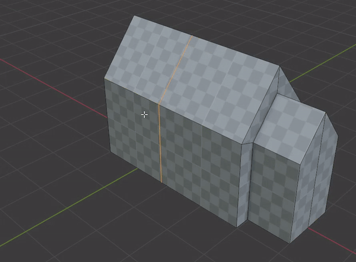
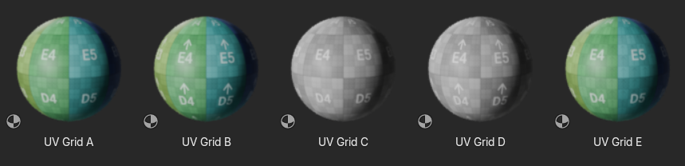

# Examples

!!! warning "Page under construction :construction_site: :construction:"

## Quick Start

A great way to get started with uvFactory is to:

1. Add a [UV Island Unwrap](create_uvs.md#island-unwrap) modifier to a cube.
2. Apply a grid material*.
3. Start modelling. UVs should remain stable and update as the mesh changes.

!!! note "*Grid Materials"
    There are grid materials included with uvFactory. Find them in the asset browser under ***UV Factory***.
    
    If you are using the ***Checker Texture*** shader node, make sure you feed in the UV map to the vector input.
