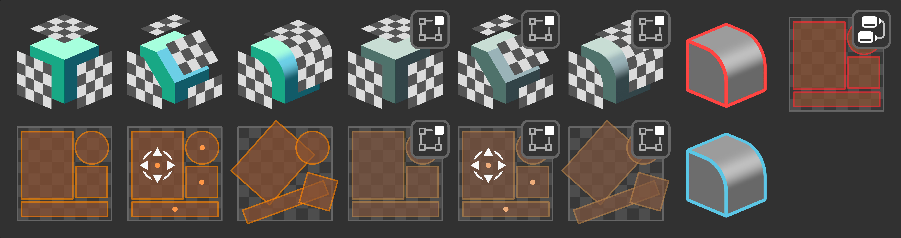

# uvFactory Home

Welcome to the uvFactory documentation! Here you'll find everything there is to know about the tools.

- [:octicons-download-16: Install uvFactory](install.md)
- [:material-run: Quick Start](examples.md#quick-start)

If anything is unclear or missing, please reach out!  
:material-email: <spaghetmenot@gmail.com>  
:fontawesome-brands-bluesky: [@spaghetmenot.bsky.social](https://bsky.app/profile/spaghetmenot.bsky.social)  
:fontawesome-brands-mastodon: [@SpaghetMeNot@mastodon.social](https://mastodon.social/@SpaghetMeNot)

## What is uvFactory?

uvFactory is a set of tools designed to automate, eliminate, or streamline tedious unwrapping tasks. Use it to speed up manual unwrapping or create fully automatic UV pipelines.

In many cases it allows you to model freely while UVs appear before your eyes.

### :material-creation-outline: Create UVs

Sophisticated projection methods create high quality UVs:

1. **Oriented**. UVs are aligned with the object's up axis by default. Ideal for directional textures e.g. bricks, tiles, wood, leaks etc.
2. **Stable**. Unlike other procedural UV solutions, the projections are stable by default and if left unpacked, don't jump around as you change your model.
3. **Automatic and manual**. All projection types are available as modifiers and tools. UVs can be created in real-time as you model, or you can use the tools directly in edit mode for fast manual UV unwrapping.

### :material-vector-square-edit: Modify UVs

Edit UVs directly in the 3D viewport or procedurally via modifiers/nodes:

- **Transform**. Offset, rotate and scale UVs.
- **Randomize**. Randomize UV transforms.
- **Pack**. Quick access to Blender's Packing algorithm.
- **Align**. Align UVs to face a desired orientation.
- **Copy**. Copy UVs from one map to another.

### :material-factory: Create your own "UV Factory"

Chain together modifiers/nodes to create your own complex UV pipeline.

- Create and manage multiple UV maps.
- Use different operations on different selections/materials.
- Expertly manage seams and sharp edges on your meshes.

----

## Where can I get uvFactory?

!!! warning "Blender 4.1+ Recommended (Blender 4.0+ Required)"
uvFactory is available on Gumroad and will be released on Blender Market for version 1.0

- [:simple-gumroad: Gumroad](https://spaghetmenot.gumroad.com/l/uvproject)

