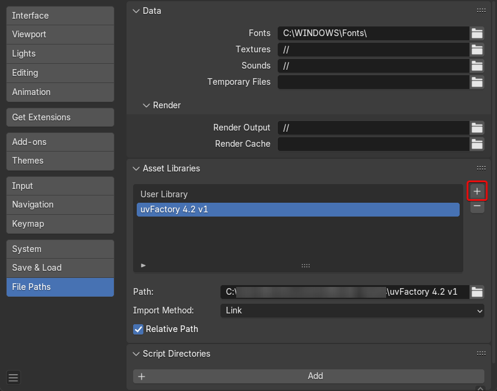
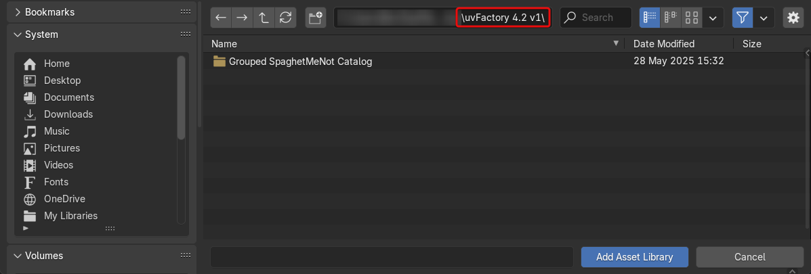

# Install uvFactory

uvFactory is installed as an asset library in Blender.

Tldr: download the zip, extract the folder, and add the folder as an asset library. For more detailed instructions see [below](#install-asset-library).

!!! info "For more information on asset libraries you can check Blender's [Official Documentation](https://docs.blender.org/manual/en/dev/files/asset_libraries/introduction.html#introduction)"

## Install Asset Library

1. Download latest .zip file for the closest Blender version. (e.g. for Blender 4.3 use "uvFactory 4.2 vX.zip")
2. Unzip/extract folder to your desired location
3. Open Blender and go to Edit/Preferences/File Paths/Asset Libraries
4. Click + Add Asset Library 
5. Navigate to the unzipped folder and press Add Asset Library. (Make sure you are in the "uvFactory" Folder) 
6. Save Preferences and **restart Blender** for modifiers/tools to show up in menus

After Restarting Blender you should have access to the uvFactory tools:

- With a mesh selected in the [***Add Modifier***](tools_overview.md#modifiers) menu.
- In the Edit Mesh [***UV***](tools_overview.md#mesh-tools) menu.
- In the Geometry Nodes [***Add Node***](tools_overview.md#geometry-nodes) menu.

## Alternative Catalog

By default, the assets are organized so that edit mesh tools will show up in Blender's default ***UV*** menu in edit mesh mode. All modifiers, nodes and materials are under a ***UV Factory*** category.

I've included an alternate catalog that groups everything under a ***SpaghetMeNot*** catalog to keep all nodes together. This may be preferable if you have lots of node asset libraries and is an option with all my asset-based tools.

To use this, simply replace ***blender_assets.cats.txt*** with the version found inside the ***Grouped SpaghetMeNot Catalog*** Folder.
