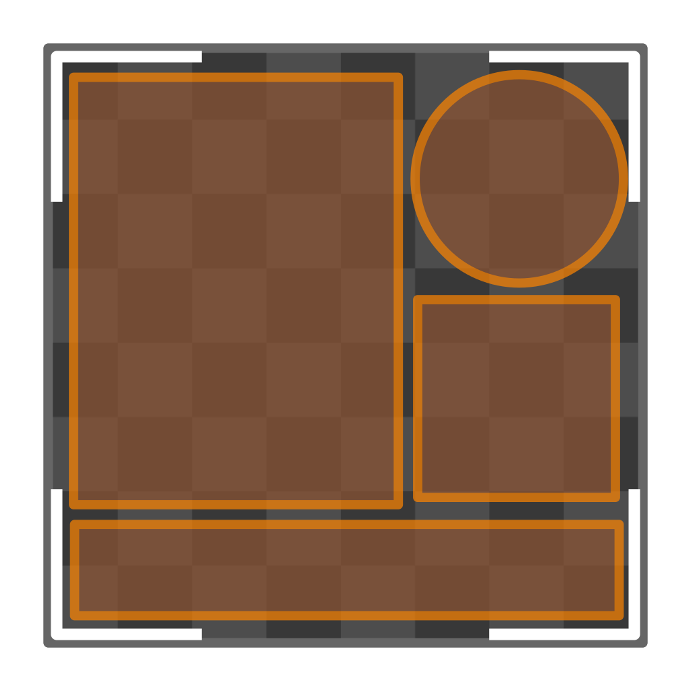

# Tools Overview

uvFactory is comprised of several tools. Some generate UVs, some modify existing UVs and some operate on related attributes.
For more information on how to use the tools:

- [Generate UVs](create_uvs.md)
- [Modify UVs](modify_uvs.md)
- [Extra Tools](extra_tools.md)

## List of Tools

uvFactory tools are available as a mix of mesh tools, modifiers and nodes. Below is a full list of tools and where they can be used. Click the name to go to the documentation for the tool.

|Tool                                                |                                                              | Mesh Tool      | Modifier       | Node           |
|----------------------------------------------------|--------------------------------------------------------------|----------------|----------------|----------------|
|[Box Project](create_uvs.md#box-project)            |{ width="64" }      |:material-check:|:material-check:|:material-check:|
|[Island Project](create_uvs.md#island-project)      |{ width="64" }   |:material-check:|:material-check:|:material-check:|
|[Island Unwrap](create_uvs.md#island-unwrap)        |{ width="64" }  |:material-check:|:material-check:|:material-check:|
|[Transform](modify_uvs.md#transform)                |{ width="64" }        |:material-check:|:material-check:|:material-check:|
|[Randomize Islands](modify_uvs.md#randomize-islands)|{ width="64" }|:material-check:|:material-check:|:material-check:|
|[Align Islands](modify_uvs.md#align-islands)        |{ width="64" }            |:material-check:|:material-check:|:material-check:|
|[Pack Islands](modify_uvs.md#pack-islands)          |{ width="64" }     |:material-check:|:material-check:|:material-check:|
|[Copy Map](modify_uvs.md#copy-map)                  |{ width="64" }         |                |:material-check:|:material-check:|
|[Sharp Edges](extra_tools.md#sharp-edges)           |{ width="64" }    |                |:material-check:|:material-check:|
|[Seam Attribute](extra_tools.md#seam-attribute)     |{ width="64" }       |                |:material-check:|:material-check:|
|[Existing Seams](extra_tools.md#uv-existing-seams)  |{ width="64" }   |                |                |:material-check:|

## Modifiers

Modifiers can be found under the ***UV Factory*** group in the ***Add Modifier*** menu.

## Mesh Tools

Mesh tools can be found in the ***UV*** Menu in ***Mesh Edit*** mode. With default hotkeys this can be accessed by pressing ++u++.

## Geometry Nodes

Geometry nodes can be found under the ***UV Factory*** group in the ***Add Node*** menu.

